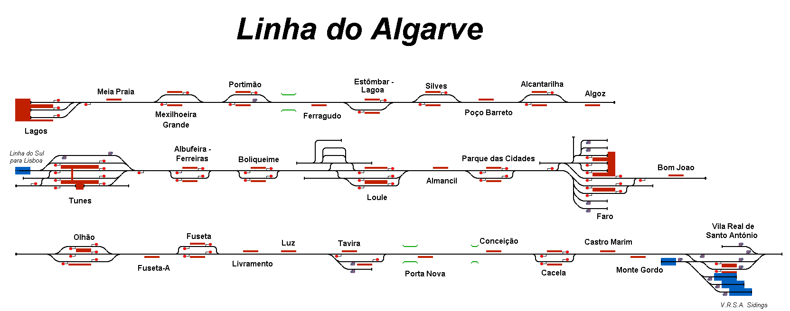

# Linha do Algarve, Portugal

Simulation of the Algarve Line which runs alongs the south Portuguese coast from Lagos to Vila de Santo Antonio. Services are split into westbound and eastbound at Faro, with occasional intercity and express services approaching Faro from north of Tunes.

## Current Status

| Stage         | Status        |
| ------------- |:-------------:|
| Track Plan     | :heavy_check_mark: |
| Signalling      | :heavy_check_mark:      |
| Naming | :heavy_check_mark:      |
| Speed Limits | :heavy_check_mark: |
| Distances | :heavy_check_mark: |
| Timetable | :heavy_check_mark: |
| Documentation | :heavy_check_mark: |

## Data Sources

- Google Streetview around stations for signal placement.
- [OpenRailwayMap](https://www.openrailwaymap.org/)
- Wikipedia for rolling stock properties.
- [RailFanEurope](http://railfaneurope.net/)
